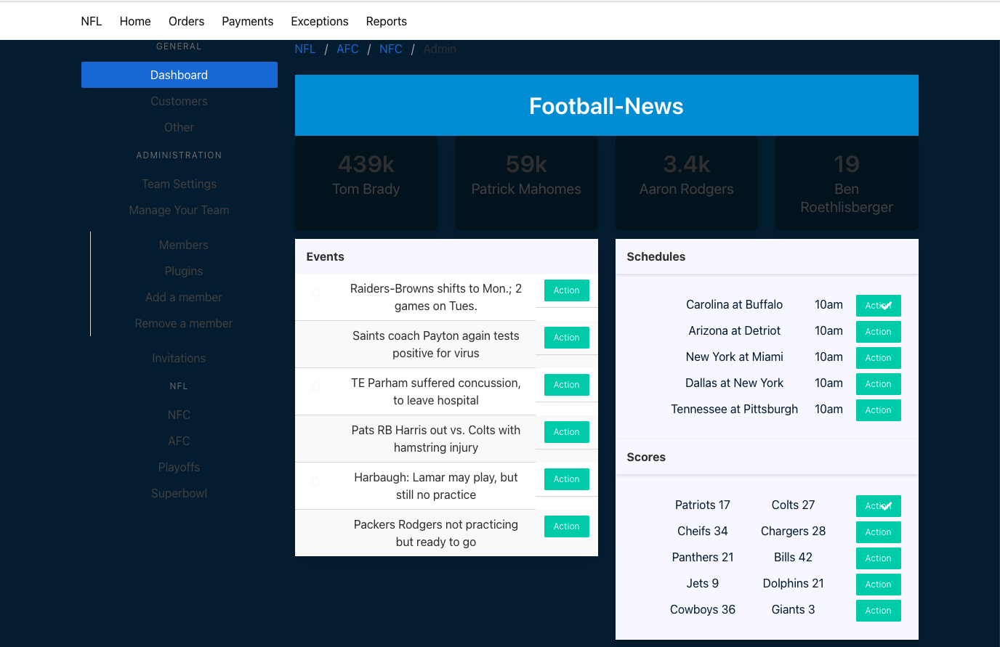

# jusfootball

a football news app

# User Story

##As a user I want to...
- Log in/Create an account.
- View footbal updates, schedules and scores.
- Be able to segment data by conference.

# Code Snippets
## Component

```
import React, { Component } from "react";

class Event extends Component {
    constructor(props) {
        super(props);
    }
    render() {

        return (


            <tr key={this.props.index}>
                <td width="5%"><i className="fa fa-bell-o"></i></td>
                <td>{this.props.title}</td>
                <td className="level-right"><a className="button is-small is-primary" href="#">Action</a></td>
            </tr>

        );

    }
}


export default Event;
```

## Data
```
const scoress = [
    {
        teamOne: 'Patriots 17',
        teamTwo: 'Colts 27'
    },
    {
        teamOne: 'Cheifs 34',
        teamTwo: 'Chargers 28'
    },
    {
        teamOne: 'Panthers 21',
        teamTwo: 'Bills 42'
    },
    {
        teamOne: 'Jets 9',
        teamTwo: 'Dolphins 21'
    },
    {
        teamOne: 'Cowboys 36',
        teamTwo: 'Giants 3'
    }
];
```

## Test
```
import { render, screen } from '@testing-library/react';
import Admin from './Admin'

test('renders Dashboard tag', () => {
  render(<Admin />);
  const spanElement = screen.getByText(/Dashboard/i);
  expect(spanElement).toBeInTheDocument();
});
```
# Installation Instructions

# Screenshots

